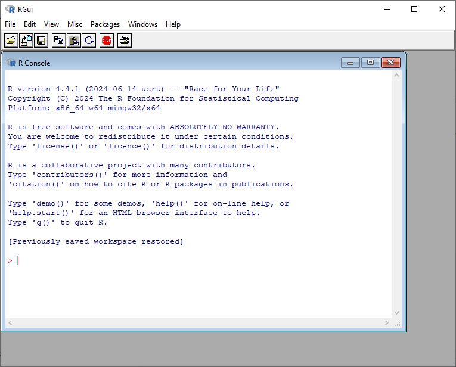

# R basics {#CHAPTER-BASICS}

In this first chapter we use R and nothing but R. @fig-H1-rgui shows the R GUI (graphical user interface) that you get to see when you open R. In this first chapter you only need to use this R Gui. In the next chapter we will switch to the RStudio IDE, but for now, let's stick to the very basics.

{#fig-H1-rgui}

## R as a calculator

One of the simplest ways to use R is to perform some basic calculations. You just need to know some basic symbols, which are mostly self-evident.

```{r}
4-1          # addition
4/2          # division
5^2          # five to the power of two
sqrt(4)      # sqrt = square root 
(34-4)+(5+4) # use brackets  
pi           # 3.1415...
log(x = 25, base = 5)    # logarithm of 25 to the base 5
exp(x = 2)   # e^2 = 2.7182^2
```

## R functions

In R, we work with functions. A function has a name and arguments: `Name(argument, argument, ...)`.

In very simple terms: a function "does something" with its arguments. There is at least one argument with necessary input (you need something to apply the function to). And there are often multiple extra arguments to tweak options regarding how the function is applied. For example, we wish to round the result of the quotient $25/6$ (= `r 25/6`) to two decimal places. For this we use the function `round()`:

```{r}
round(x = 25/6,    # <1>
      digits = 2)  # <2>
```

1.  "x" is the first argument
2.  "digits" is the second argument

The first argument is the minimally required input, while the second is optional, that is to say that R has a default setting for the number of digits. Compare:

```{r}
round(x = 25/6)
```

Strictly speaking, we don't need to write the names of the arguments (here: "x =" and "digits ="), but it makes the code more readable. It's also my experience that not using the argument names is one reason why R-code can be quite opaque. Compare the code above with the one below.

```{r}
round(25/6, 2)
```

You get the same result, but the former code with the argument names provides more information to the user; you need to remember what the second argument does. Moreover, documenting your code is always a good idea if you want to share your code in the spirit of Open Science.

Similarly:

```{r}
ceiling(5.67) 
floor(5.67)
```

## Packages

When you open R, you automatically open a number of **packages**. Base-R is one such package.

Opening a package is like taking a book from a library with functions and data that allows you to work in R.

Besides base-R, there are many other packages written by R users that contain a specific sets of functions and datasets. You can look at these packages as specialised toolboxes.

To use those other packages, you must first install these via `install.packages()` and then open them using `library()`.

```{r}
#| eval: FALSE
install.packages("bayesplot")
library("bayesplot")
```

When you use a particular package in your research, make sure to cite the package in your final output (article, report, book, thesis, etc.). That way you give proper credit to the package author(s). Use the function `citation("package")` to get the reference(s):

```{r}
citation("bayesplot")
```

And always cite R and give credit to the R Core Team:

```{r}
citation()
```

## The assignment operator

We assign the value $10$ to the object $x$.

```{r}
x <- 10 # <1> 
```

1.  read: "x gets value $10$"

R now *knows* that `x` is the "name" for the value of $10$. Let's evaluate `x`:

```{r}
x
```

Actually, we have used the function `print()` here, without spelling it out explicitly:

```{r}
print(x)
```

Note that the assignment operator ('\<-') consists of the two characters ‘\<’ (“less than”) and ‘-’ (“minus”). Some textbooks use "=" as an alternative. It is also possible (but never done) to use the `assign()` function:

```{r}
assign("y", 10.3) # <1> 
y                 # <2> 
```

1.  assign 10.3 to y
2.  print(y)

We can know use `x` instead of $10$:

```{r}
x+9
```

Writing your own function can be quite easy:

```{r}
square <- function(x){x^2}
```

Let's apply this function to a number:

```{r}
square(x = 5)
```

Or to a vector of numbers:

```{r}
square(x = c(1,2,3,4,5))
```

As a beginner, there are more than enough functions in base-R and the existing packages. So in this course we will not create our own functions.

## Vectors

One of the most important data structures in R is the vector, which is basically a row of similar data (e.g. all numeric objects, all integers, all characters). We create a vector of 5 numbers and give it the name `mydata`:

```{r}
mydata <- c(4,6,8,2,7)
mydata
```

To create a vector, we use the function `c()`, which stands for "concatenate" or "combine". Then we apply a function to the vector. For instance, how many elements does `mydata` include? (Or, how long is the vector?):

```{r}
length(mydata)
```

Most functions in R are "vectorized", which means that the function operates on all elements of the vector.

There's no need in R to write a "loop" to act on every element (this is getting a bit technical, but this is a an important difference between R and other programming languages).

For instance, we wish to add $3$ to every element of `mydata`:

```{r}
mydata+3
```

It's also possible to create a vector of "words" (or better still of "characters", sometimes refered to as "strings")

```{r}
myfriends <- c("Beatrijs", "Fatemeh", "Leo", "Astrid", "Lize")
```

This is a character vector:

```{r}
str(myfriends)
```

How many friends are there?

```{r}
length(myfriends)
```

We'll have a closer look at the character vector later on in the course.

## Statistical functions

We create a vector `WordsPerSentence`.

```{r}
WordsPerSentence<-c(12,3,34,23,23,34,12,23,12,
                    23,34,23,12,23,34,23,26,27) 
```

And apply some statistical functions from base-R:

```{r}
max(WordsPerSentence)                # maximum
min(WordsPerSentence)                # minimum   
sum(WordsPerSentence)                # sum
mean(WordsPerSentence)               # mean
median(WordsPerSentence)             # median
range(WordsPerSentence)              # range (max - min)
var(WordsPerSentence)                # variance   
sortedorder<-sort(WordsPerSentence)  # sorted vector
order(WordsPerSentence)              # orde  
fivenum(WordsPerSentence)            # five number summary
summary(WordsPerSentence)            # five number summary
```

At this stage, it might be worthwhile to have a look at the "objects" that we have created:

```{r}
ls()
```

You can remove objects with `rm()`:

```{r}
rm("y") # to remove y, an object that we created earlier 
```

To remove all objects:

```{r}
rm(list=ls())
```

## Categorical data

In statistics, we distinguish between two kinds of variables:

-   continuous variable (also called "quantitative")
-   categorical variable (also called "qualitative")

Continuous variables are based on measurements (e.g., length, number of words, height, etc.) Categorical variables have a limited number of categories as their values (e.g., Correctness with "correct" vs. "incorrect", Animacy with "animate" vs. "inanimate")

For example, let's say we asked 10 participants about their educational level, operationalized as a three level categorical variable:

-   "high": highschool level
-   "ba": bachelor level
-   "ma": Master level

We enter their responses as a vector in R:

```{r}
EduLevel <-c("high", 
              "high", 
              "ba", 
              "high", 
              "ba", 
              "ma", 
              "ma", 
              "ma", 
              "high", 
              "ma") 
```

`EduLevel` is a character vector:

```{r}
str(EduLevel)
```

We transform the character variable to a factor, which is more convenient (and required) for a statistical analysis. A factor variable includes different levels.

```{r}
EduLevel <- as.factor(EduLevel)
str(EduLevel)
```

`EduLevel` is now a factor variable with three categories or levels. R assigns a number to every category.

Levels are assigned alphabetically. This can be overruled and the levels can be binned (something that we will do later in this course).

We summarize the factor variable by means of the `table()` function.

```{r}
table(EduLevel) 
```

Proportions or fractions are calculated with `prop.table()`.

```{r}
prop.table(table(EduLevel))
```

Notice that we have created a so-called "nested" function. This can be avoided by using a so-called pipe function ("\|\>" or "%\>%"):

```{r}
table(EduLevel) |> prop.table()
```

## Missing values

Missing values are indicated by "NA".

Here we create a vector `RT` (Reaction time), with one missing variable:

```{r}
RT <- c(345, 367, 440, 438, NA, 500, 270)
is.na(RT)
```

`is.na()` is a logical function. The output of the function is another vector with TRUE or FALSE. So 345 is not a missing value, so this gets the value "FALSE", 367 is not a missing value, so this gets the value "FALSE", etc.

We can extract which observation is a missing value by means of `which()`:

```{r}
which(is.na(RT)) # again a nested function
```

So the fifth value of the vector `RT` is a missing value.

But how many missing values are there?

```{r}
length(which(is.na(RT)))
```

## Logical operators

Is $5$ larger than $3$?

```{r}
5 > 3
```

Is $x$ smaller $y$?

```{r}
x <- 5 # create an object x and assign this x the number five  
y <- 16 # create an object y and assign this y the number sixteen  
x < y  # is x smaller than x? 
```

Other useful logical operators:

```{r}
x <= 5    # smaller than or equal to  
y >= 20   # larger than or equal to
y == 16   # equal to
x != 5    # different from
```

## Index function

Square brackets are important symbols in R. It allows you to extract elements from an object. We call this an index function.

For instance, here we extract the third element of the vector score.

```{r}
score <- c(18, 12, 17)
score[3]
```

`letters` is an existing object in base-R and consists of the letters (in lower case) of the alphabet.

```{r}
alfabet <- letters
alfabet
```

We use the index function, i.e., the square brackets, to extract different elements:

```{r}
alfabet[3:5]                
alfabet[c(8,5,12,12,15)]     
alfabet[-1]                 
alfabet[-c(1,3)]            
```

## Sampling

One of the major advantages of R is its capability to perform simulations. This allows one to bypass the need for actual experiments and instead conduct virtual experiments. In contemporary empirical research, this approach is crucial as it enables the evaluation of hypotheses and the assessment of their plausibility. A fundamental step in this process is the creation or selection of a sample. In this context, we will generate a dataset consisting of $N = 10$ elements and subsequently draw a random sample of 5 elements from it.

```{r}
score<-c(65,45,78,56,89, # <1>        
        34,12,34,33,78)  # <1>  
sample(x = score,        # <2>          
       size = 5,         # <3> 
       replace=FALSE)    # <4>
```

1.  Create a dataset (vector) with $N=10$ observations.
2.  Take a random sample from 'score'
3.  a sample of $n=5$
4.  without replacement

We could also sample with replacement:

```{r}
coin<-c("head","tail") 
sample(x = coin, 
       size = 20, 
       replace=TRUE)
```

Here we simulate tossing a coin twenty times. There are two possible events: head or tail. Both have an equal probability ($50\%$). Suppose that we have a binary outcome variable or the outcome of an process that generates two possible events of which one event is taken to occur with a $70\%$ probability. We can simulate this by adapting the argument `prob`:

```{r}
data<-c(0,1) 
sample(x = data, 
       size = 20, 
       prob = c(0.30, 0.70), 
       replace=TRUE)
```

With `rnorm()` we can draw a random sample from a normal distribution. We draw a random sample of $N=200$ observations from a normal distribution with mean $\mu=4.5$ and standard deviation $\sigma=2$.

```{r}
rnorm(n = 20,           # <1>
      mean = 4.5,       # <2>
      sd = 2)           # <3>
```

1.  Number of observations to sample
2.  the population average $=\mu$
3.  the population standard deviation $=\sigma$.

## Data visualisation (univariate)

Some basic visualisations of continuous and categorical variables. No shining bells or whistles here, just the very basics.

### Histogram

@fig-H1-histnile is based on what is arguably the simplest code ever\^\[ thank you, Norman Matloff, for the inspiration. I invite every reader of this course book to take Matloff's online course <https://github.com/matloff/fasteR>)\]:

```{r}
#| fig-cap: "A histogram of the Nile dataset."
#| label: fig-H1-histnile
#| fig-width: 4.5
#| fig-height: 4
hist(Nile)
```

`Nile` is a dataset from the base-R package. The simplicity of the code illustrates how R (and its predecessor S) was developed as a quintessential statistical programming language.

We will now create a histogram based on a dataset that we generate ourselves.

Let's create a continuous variable `ReactionTime` with $N=1000$ observations sampled from a normal distribution.

We can assume a mean reaction time of $300\,ms$ and a standard deviation of $10\,ms$. \^\[This is an incorrect assumption. Reaction times are highly skewed and lognormally distributed at best. But his will do for now\].

Next, we apply the `hist()` function to our `ReactionTime` object, as shown in Figure @fig-H1-hist."

```{r}
#| fig-cap: "A histogram of Reaction Time"
#| label: fig-H1-hist
#| fig-width: 4.5
#| fig-height: 4
ReactionTime <- rnorm(n = 1000, mean = 300, sd = 10)  # <1>
hist(ReactionTime,                                    # <2>
     main = "",                                       # <3>
     ylab = "Frequency",                              # <4>
     xlab = "Reaction Time (ms)")                     # <4>
```

1.  We create the variable `ReactionTime`
2.  we apply `hist()`; the first argument is the data that we wish to visualise
3.  main = "" creates a title on top of the figure, but here we keep this empty
4.  we add a label to both axes.

### Density curve

@fig-H1-dens visualizes the same dataset or vector `ReactionTime` by means of a density curve.

```{r}
#| fig-cap: "A density curve for Reaction Time."
#| label: fig-H1-dens
#| fig-width: 4.5
#| fig-height: 4
densRT <- density(ReactionTime)          # <1>
plot(densRT,                             # <2>
     main = "",                          
     ylab = "Density",             
     xlab = "Reaction Time (ms)")                      
```

1.  First, a density object is created
2.  `plot()` visualises the density object (R "knows" that a density curve should be plotted), and tweak some aesthetics

### Boxplot

@fig-H1-box visualizes `Reactiontime` by means of a boxplot. A boxplot visualizes location values minimum, first quartile, median, third quartile, and maximum. Outliers are indicated as "o". An outlier is defined as any observation that is more than 1.5 times the interquartile range removed from the nearest quartile. The IQR is the range between Q1 and Q3, i.e., the length of the box.

```{r}
#| fig-cap: "A boxplot of Reaction Time."
#| label: fig-H1-box
#| fig-width: 3.5
#| fig-height: 3.5
boxplot(ReactionTime,                  
        ylab = "Reaction time (ms)")                
```

### Stripchart

If there are only a few observations, a simple stripchart as in @fig-H1-strip might suffice:

```{r}
#| fig-cap: "A dot plot of Reacton Time."
#| label: fig-H1-strip
#| fig-width: 3.5
#| fig-height: 3.5
sampleRT <- sample(x = ReactionTime, size = 8)    # <1>
stripchart(sampleRT,                              # <2>
           xlab = "Reaction time (ms)",           # <3>
           pch = 1)                               # <4>
```

1.  Take a random sample from ReactionTime
2.  apply strichart to the newly created sample
3.  add a label to the horizontal axis
4.  uses round points rather than the default square ones

### Barplot

We create a factor vector "Animacy" with two values "animate" vs\< "inanimate" with `rep()`.

```{r}
Animacy <- rep(x = c("animate", "inanimate"),     # <1>
               times = c(68, 32))                 # <2>
```

1.  Create a variable Animacy with two levels: "animate" vs. "inanimate",
2.  each level is repeated 68 and 32 times, respectively.

Let's look at the first 10 observations of the vector:

```{r}
head(Animacy, n = 10)
```

Before we can visualise the vector by means of a barplot, we first need to count the number of observations for each level of the variable.

```{r}
tt <- table(Animacy)                      
```

Then we can apply `barplot()` to th etable object, which gives @fig-H1-barplot.

```{r}
#| fig-cap: "A barplot of the variable Animacy."
#| label: fig-H1-barplot
#| fig-width: 3.5
#| fig-height: 3.5
barplot(tt,                  # <1>  
        xlab = "Animacy")    # <2>
```

1.`tt` is the object that was created with `table()`

2\. xlab adds a label to the horizontal axis.

### Scatterplot

@tbl-prepost presents a mock dataset for ten participants who performed a pre- and posttest.

| ID  | Pretest | Posttest |
|:---:|:-------:|:--------:|
|  1  |   13    |    15    |
|  2  |    8    |    9     |
|  3  |   11    |    16    |
|  4  |   12    |    13    |
|  5  |   16    |    17    |
|  6  |   15    |    17    |
|  7  |   11    |    12    |
|  8  |    6    |    10    |
|  9  |   10    |    13    |
| 10  |   14    |    15    |

: Pre- en Posttestscores {#tbl-prepost}

We wish to visualize the relationship between both scores by means of a scatterplot. We create two vectors, one for each test and apply the `plot()` function. @fig-H1-scatter shows the result.

```{r}
#| fig-cap: "A scatterplot of Pre- and Posttest scores."
#| label: fig-H1-scatter
#| fig-width: 3.5
#| fig-height: 3.2
Pretest <- c(13, 8, 11, 12, 16, 15, 11, 6, 10, 14)      # <1>
Posttest <- c(15, 9, 16, 13, 17, 17, 12, 10, 13, 15)    # <1>
plot(x = Pretest, y = Posttest,                         # <2>
     xlab = "Score Pretest",                            # <3>
     ylab = "Score Posttest")                           # <3>
```

1.  We create the two vectors
2.  pick the data for each axis
3.  label each axis.

To visualize a possible linear relationship, we can add a linear regression line with `abline()`.

The coefficients of the line are extracted by means of the `lm()`function. Note that once again R knows what kind of "plot" to draw to create the scatterplot in @fig-H1-scatterregr.

```{r}
#| fig-cap: "A scatterplot of Pre- and Posttest scores with a regression line."
#| label: fig-H1-scatterregr
#| fig-width: 3.5
#| fig-height: 3.2
plot(x = Pretest, y = Posttest,
      xlab = "Score Pretest", 
      ylab = "Score Posttest")
abline(lm(Posttest ~ Pretest)) 
```

## Exercises

### **Exercise 1.1** {.unnumbered}

1.  Calculate the following.

    a.  7+8
    b.  15-8
    c.  the product of 23 and 34
    d.  2 raised to the power of 3
    e.  the square root of 25
    f.  sine of π/4
    g.  the expression $\frac{(3 + 5) \times (2^3)}{\sqrt{16}}$

### **Exercise 1.2** {.unnumbered}

1.  We measured the height of basketball players (in cm): 189, 190, 198, 210, 213, 234, 205, 207, 198, 199, 189, 203, 204, 207, 188, 187, 179, 209, 205, 204, 206, 200, 199, 198, 198, 206, 204, 175, 201.

    a.  Create a vector in R called "height" and assign the measurements to this object
    b.  How many observations are there?
    c.  What is the average height of the players?
    d.  Use R to calculate:
        -   maximum
        -   minimum
        -   median
        -   standard deviation
        -   variance

2.  Use a function to find help on the `mean()` function

3.  R contains several datasets which are loaded automatically.

    a.  Open the dataset `ToothGrowth`.
    b.  Assign the name `tg` to the dataset `ToothGrowth`.
    c.  How many variables does `tg` have? (tip: use `str()`)

### **Exercise 1.3** {.unnumbered}

1.  Create a vector "numbers" with all numbers from 1 to 20
2.  Replace the third element with "NA"
3.  What is the average of the vector numbers?
4.  What is the sum of all numbers larger than $10$?
5.  How many numbers are larger than $15$?
6.  Extract the fourth element.
7.  A lexical decision task returned the following results: {word, non-word, non-word, non-word, non-word, word, word, word, word}. Use R to calculate the proportion of words.

### **Exercise 1.4** {.unnumbered}

Reconsider the `height` dataset that you created in Exercise 1.2.

1.  Visualize the data by means of a yellow histogram.
2.  Visualize the data by means of a blue horizontal boxplot and label the horizontal axis.
3.  Take a random sample of 5 players and visualize the sample with a vertical stripchart.
