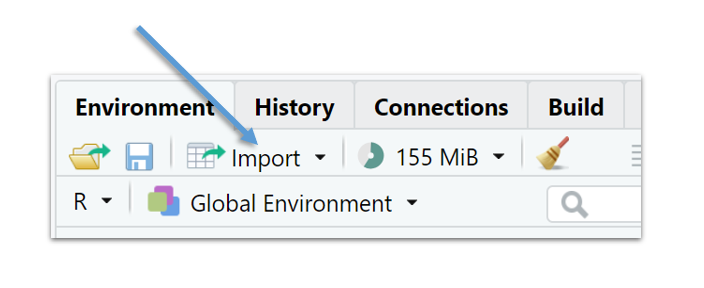
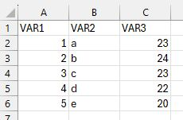
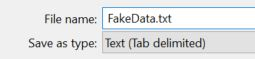

# The dataframe {#CHAPTER-DATAFRAME}

When you collect data by means of an experiment or via observational research, you need to apply the correct dataformat to your data.

I won't go into detail about the different dataformats here, but in all likelihood you will shape your data in some kind of spreadsheet format with rows and columns, in which each column represents a variable and with the first row (header) indicating the names of your variables, as in @tbl-abstract:

|  Variable   |  Variable   |  Variable   |
|:-----------:|:-----------:|:-----------:|
| measurement | measurement | measurement |
| measurement | measurement | measurement |
| measurement | measurement | measurement |

: An abstract dataset with rows and columns {#tbl-abstract}

In R, this kind of object has its own data structure called a "dataframe". Basically, you "tell" R that the combination of rows and column is one dataset or dataframe.

To introduce the concept of a dataframe, we will first construct two dataframes by combining vectors of the same type and length into a single dataframe.

After we have created dataframes in R, we will open an external dataset, which is what you will mostly do. Rarely is a dataframe directly created, except for pedagogical purposes perhaps or to simulate some data or a model.

Typically, a researcher prepares a dataset in some kind of spreadsheet software like MS Excel or some other specialized software before importing it into R.

## How to make a dataframe in R: example 1

@tbl-freqrt represents a simple dataset based on a Lexical Decision Task of 6 rows. In a lexical decision task participants have to decide whether a string of characters is an existing word or a not.

| Participant | Item | Frequency | ReactionTime |
|:-----------:|:----:|:---------:|:------------:|
|      1      |  a   |   high    |     320      |
|      2      |  b   |    low    |     380      |
|      3      |  c   |    low    |     400      |
|      4      |  d   |   high    |     300      |
|      5      |  e   |   high    |     356      |
|      6      |  f   |    low    |     319      |

: A dataset based on a Lexical Decision Task {#tbl-freqrt}

@tbl-codefreqrt explains the variables in a codebook (aka codesheet). A codebook documents and explains the variables in the dataset. Every row now represents a single variable. It's good practice to document your data and R-code so that other researchers (including the future you) can interpret the data.

| ID | Variable | Description |
|:--------------:|:---------------|:---------------------------------------|
| 1 | Participant | a unique identification number for each participant |
| 2 | Item | the word used as a stimulus |
| 3 | Frequency | the frequency of the item, a binary categorical variable: "high" vs. "low" |
| 4 | Reaction Time | the reaction time (in ms) of the participant to the item |

: Codebook for the dataset based on a lexical decision task {#tbl-codefreqrt}

Let's create a dataframe for the dataset in @tbl-freqrt. We start by creating every variable (or column) as a separate vector. It doesn't matter that you write each vector as a row rather than as a column.

```{r}
Participant <- c(1,2,3,4,5,6)                  # <1>
Item <- c("a", "b", "c", "d", "e", "f")        # <1>
Freq <- as.factor(c("high", "low", "low",      # <1>
                    "high", "high", "low"))    # <1>
RT <- c(320, 380, 400, 300, 356, 319)          # <1>
df <- data.frame(Participant, Item, Freq, RT)  # <2>
df                                             # <3>
```

1.  First we create every variable as separate vectors
2.  the vectors are transformed into a dataframe data structure with `data.frame()`
3.  print/look at the dataframe.

## How to make a dataframe in R: example 2

We now simulate an artificial dataset to compare scores (out of 20) between two groups: one group that received a treatment, referred to as "Treat," and a control group referred to as "Control." The term "treatment" has a very general interpetation in research methodology and is not limited to a medical intervention. For instance, in the context of educational research, a treatment might involve following a new teaching method. The dataset is structured as in @tbl-H2-scoredata:

| ID  |  Group  | Score |
|:---:|:-------:|:-----:|
|  1  | control |  14   |
|  2  | control |  15   |
| ... |   ...   |  ...  |
| 59  |  treat  |  12   |
| 60  |  treat  |  17   |

: A fake dataset with an identifier variable, a categorical variable Group, with two levels (control vs. treat) and a continuous variable Score. The dataset contains three columns/variables and 61 rows - 1 header row with the variable names and 60 rows with the data. {#tbl-H2-scoredata}

We can simulate this artificial dataset as follows:

```{r}
Group <- gl(n = 2,                                         # <1>  
            k = 30,                                        # <2> 
            labels = c("control", "treat"))                # <3> 
Score <- c(round(rnorm(n = 30, mean = 16, sd = 0.8),0),    # <4>
           round(rnorm(n = 30, mean = 12, sd = 0.9),0))    # <4>
df <- data.frame(Group, Score)                             # <5>
head(df)                                                   # <6>
```

1.  Group is a two-level factor variable, ("gl" = "generate levels")
2.  with 30 observations for each level,
3.  which we label "control" and "treat",
4.  we create a numeric vector Score based on two samples of 30 observations from two normal distributions. The observations are rounded,
5.  combine the vectors into a dataframe structure,
6.  and examine the first six rows.

You can look at the full dataset in a separate window via `View()`.

```{r}
#| eval: false
View(df)
```

You can edit the dataframe in a spreadsheetlike manner via `edit()`:

```{r}
#| eval: false
edit(df)
```

You can actually create a dataframe from scratch with:

```{r}
#| eval: false
df_2 <- edit(data.frame())
```

## R datasets

Base-R and other packages have built-in datasets.

Simply writing the name and running the code opens the `sleep` dataset:

```{r}
sleep
```

The `sleep` dataset contains three variables:

-   `extra`: the number of extra hours of sleep after taking a sleep medication,
-   `group`: two sleep medications were tested by 10 participants,
-   `ID`: an identification number for each participant (not for each row!).

We can view the structure of a dataframe using `str()`.

```{r}
str(sleep)
```

`extra` is a numeric variable (a number with decimal places). `group` and `ID` are factors, categorical variables with 2 and 10 possible values, respectively. The output for the factor variables can be interpreted as follows:

`$ group: Factor w/ 2 levels "1", "2": 1 1 1 ...`

"1" and "2" are the names of the levels, which R converts into numerical values, 1 and 2.

Thus, 1 1 1 in the output above indicates that the first three values of the variable are "1". The levels are arranged alphabetically by R, unless specified otherwise.

Which datasets are included in base-r?

```{r}
#| eval: false
data()
```

For more information on the dataset sleep use:

```{r}
#| eval: false
help("sleep")
```

## Opening a Text File as a Dataframe

As mentioned already, it is very uncommon to create a dataset directly in R. Researchers typically use a spreadsheet application such as MS Excel to prepare the data first. For very large datasets, a relational database might be used. Sometimes researchers us specialized software, such as PRAAT or ELAN for specific types of data. After data collection, cleaning, and annotation, the data is typically saved as a text file (.csv or .txt file).

In a .txt file, tabs are used as delimiters, whereas for a .csv file, a comma (",") or semicolon (;) is used as delimiters (a delimiter is a symbol that indicates the separation between columns).

By way of example we open a .csv-file from De latte [-@delatte2023]. The file is published in the online repository **TROLLing** (<https://dataverse.no/dataverse/trolling/>). Here is the dataset abstract.

> This dataset contains one datafile (.csv) used to create the graphs and tables in the paper "(Im)polite uses of vocatives in present-day Madrilenian Spanish". It includes 534 Spanish vocative tokens, i.e. (pro)nominal terms of direct address (e.g., tío 'dude'), which were retrieved from CORMA, a conversational corpus of peninsular Spanish compiled between 2016 and 2019. The data is annotated for (i) form, (ii) communication, (iii) semantic category, (iv) speaker's generation, (v) speaker's gender, (vi) relationship between speaker and hearer, (vii) socio-pragmatic character of the hosting speech act, (viii) the hearer's reaction, and (ix) the vocative's socio-pragmatic effect.

Before you can import the data in R, you need to download the data first and store the data file in a folder/directory (you might want to create a new folder first - and remember the name and the location of this folder!).

Then you assign this folder as your "working directory", which is the directory or folder where you keep all the files related to a particular project.

Your current working directory can be found via `getwd()`. You change your working directory with `setwd()`.

```{r}
#| eval: false
getwd()
# "C:/Users/lfdcuype/Documents"
setwd("C:/Users/lfdcuype/MILS_Module_1")
```

When your R-script and data file have been stored in the same folder which has been set as the working directory, you can use the `read.csv()` function to open the .csv-file, as follows:

```{r}
vocative <- read.csv("dataset_ImPoliteVocatives_20230530.csv", # <1>
                     sep=";",                                  # <2>
                     stringsAsFactors=TRUE)                    # <3>

```

1.  The name of the data file (note the quotation marks),
2.  ";" is the delimiter (the symbols that distinguishes the columns),
3.  strings are interpreted as factors.

Actually, there are different ways to import a data file in R.

My favourite way - and arguably the easiest one - is by means of the Import dataset function in the Environment tab in RStudio, shown in @fig-importrstudio:

{#fig-importrstudio width="320"}

After you imported the dataset in R, go the the History tab and copy-paste the R-function that was automatically created when you imported the data through the RStudio dialogue to your R-scipt or notebook.

::: callout-tip
## Import Data

Put your data and R-script/Notebook in the same folder. Use Import Dataset and copy the R-function from History to your R-script/Notebook.
:::

## Exploring a dataframe

There are several basic functions that I always use to explore a new dataset. First, I like to explore the different variables by means of `str()`, which offers basic overview of the data structure(s)

```{r}
str(sleep)
```

Or, I start by having a look at the names of the variables:

```{r}
names(sleep)
```

How many rows and columns are there?

```{r}
dim(sleep)
```

Every data analysis should start with a univariate summary of all variables.

A handy function is `summary()`.

```{r}
summary(sleep)
```

I also like to eyeball the first and last rows of the dataset.

The first six rows of the dataset:

```{r} head(sleep)}
```

And the last six rows:

```{r} tail(sleep)}
```

Other descriptive functions can be found in specific packages.

Here's the `describe()` from the `Hmisc` package [@Hmisc].

```{r}
#| message: false
library(Hmisc)
describe(sleep)
```

## Applying functions to a variable from a dataframe

Let's tabulate the variable `group` from `sleep`.

```{r}
table(sleep$group)
```

All the functions outlined earlier can be applied to variables of a dataframe. For instance, here's some code to create a boxplot of the variabele `extra` as in @fig-h2-boxplot.

```{r}
#| label: fig-h2-boxplot
#| fig-cap: A boxplot of the variable extra from sleep.
boxplot(sleep$extra)
```

::: callout-note
To avoid the use of "DATAFRAME\$", you can use the `attach()` function. And when you're done you use the detach() function. It simplifies the code, but if you work with multiple dataframes, you run the risk of loosing track of what you attached.

```{r}
attach(sleep)
boxplot(extra)
```

```{r}
detach(sleep)
```
:::

## Selecting/subsetting data from a dataframe

The index function with the square brackets also works on dataframes. Dataframes have rows and columns and so the index function involves two dimensions.

We extract the first four rows from `sleep`.

```{r}
sleep[1:4,]
```

We extract all rows for which there is a positive extra amount of sleep.

```{r}
sleep[sleep$extra>0,]
```

Notice the dollar sign "\$". With the dollar sign a variable is selected from a dataframe.

What is the average amount of extra sleep?

```{r}
mean(sleep$extra, na.rm=TRUE)
```

Another way to select data is via de `subset()` function. Here we create a new dataframe `sleep_drug1` by selecting the control group from the `sleep` dataset.

```{r}
sleep_drug1 <- subset(sleep,         # <1>
                    group=="1")      # <2>
summary(sleep_drug1)                 # <3>
```

1.  "sleep_drug1" is the name of the new dataset, and we take a subset from sleep,
2.  the selection, here group with level 1,
3.  a summary of the new dataframe.

Here's a more complex subset with two criteria:

```{r}
sleep_2 <- subset(sleep,                      
                    group=="1" & extra>0)      # <1>
sleep_2
```

1.  the first group that also slept longer ("extra" = increase in hours of sleep)

Important: when you take a subset, the original levels remain:

```{r}
summary(sleep_drug1)
```

Use the `droplevels()` to remove unselected levels.

```{r}
sleep_drug1 <- subset(sleep,             
                    group=="1")      
sleep_drug1 <- droplevels(sleep_drug1)
summary(sleep_drug1)                     
```

## Creating a new variable

We calculate a z-score for `extra` in the sleep data. The dollar sign ("\$") is used to add the variable to the existing dataframe.

```{r}
sleep$extra_z <- (sleep$extra-mean(sleep$extra))/sd(sleep$extra)
head(sleep)
```

Note that if you do not use the dollar sign, you create a new vector without adding it as a variable to the sleep dataset.

## tapply()

This is a convenient function to compare different groups in your data. For instance, here we calculate the average extra time of sleep for both groups.

```{r}
tapply(X = sleep$extra,           # <1> 
       INDEX = sleep$group,       # <2>
       FUN = mean)                # <3>
```

1.  The variable on which we wish to apply the function in 3,
2.  the categorical variable to split the data,
3.  the function to apply to 1.

So `Group` number 1 has an average extra sleeping time of $0.75$ hours, while Group number 2 has an average extra sleeping time of $2.33$ hours.

## Save a dataframe as a datafile

After you create a dataframe "df", you can save it as a .csv-file with `write.csv` or `write.csv2`.

```{r}
#| eval: false
write.csv2(df, file = "df.csv")
```

-   `.csv2` uses a semicolon (";") as a delimiter and a comma (",") for the decimal point.

-   `csv` uses a comma (",") as a delimiter and a full stop (".") for the decimal point.

If you prefer a tab delimited txt file, use:

```{r}
#|eval: false
write.table(df, file = "df.txt", sep = "\t",
            row.names = FALSE)
```

## Exercises

### **Exercise 2.1** {.unnumbered}

1.  Create a new folder in your basic "Documents" folder. Give this folder a simple name and remember the location of this new folder.
2.  Open a new R-script and set the new folder as your working directory
3.  Create a small mock-dataset in Excel with three variables and five rows, as in @fig-H2-fakeexcel:

{#fig-H2-fakeexcel}

4.  Save the file as a .txt-file (FakeData.txt, cf. @fig-H2-savetxt) in the working directory.

{#fig-H2-savetxt}

5.  Open the dataset in R with `read.delim()`.
6.  What are the names of the variables?
7.  Give a univariate summary of every variable.

### **Exercise 2.2** {.unnumbered}

1.  Open the `multitask` dataset, which we created in Activity 1, and give the dataframe the name "multi".
2.  Give a univariate summary of all variables.
3.  Use `tapply()` to calculate the median Time for both Tasks.
4.  Take a subset of the simultaneous task.
5.  Visualize this subset by means of a histogram.
6.  Create a new variable `Time_c` by subtracting every observation for the Variable `Time` from its mean. (this is called centering the data, hence the use of "\_c").

### **Exercise 2.3** {.unnumbered}

1.  Download & Open `Listening_to_Accents_Comprehensibility_Accentedness.csv`. Give the dataframe the name "comp".
2.  Visualise `Comprehensibility` by means of a barplot and a histogram.
3.  How many observations are there for every `Accent`?
4.  Visualize `Accent` with a piechart. (check `help("pie")`).
5.  Create a new Variable in which you bin the Accent levels into two or three groups.
